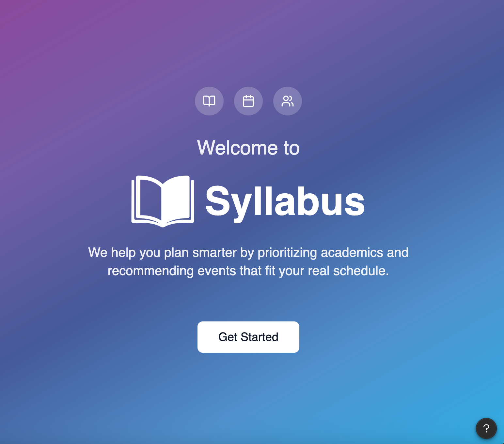
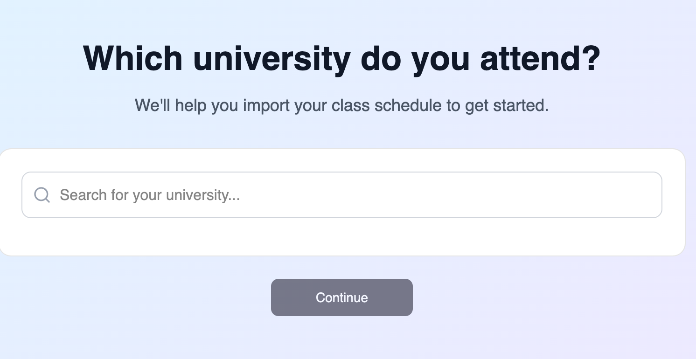
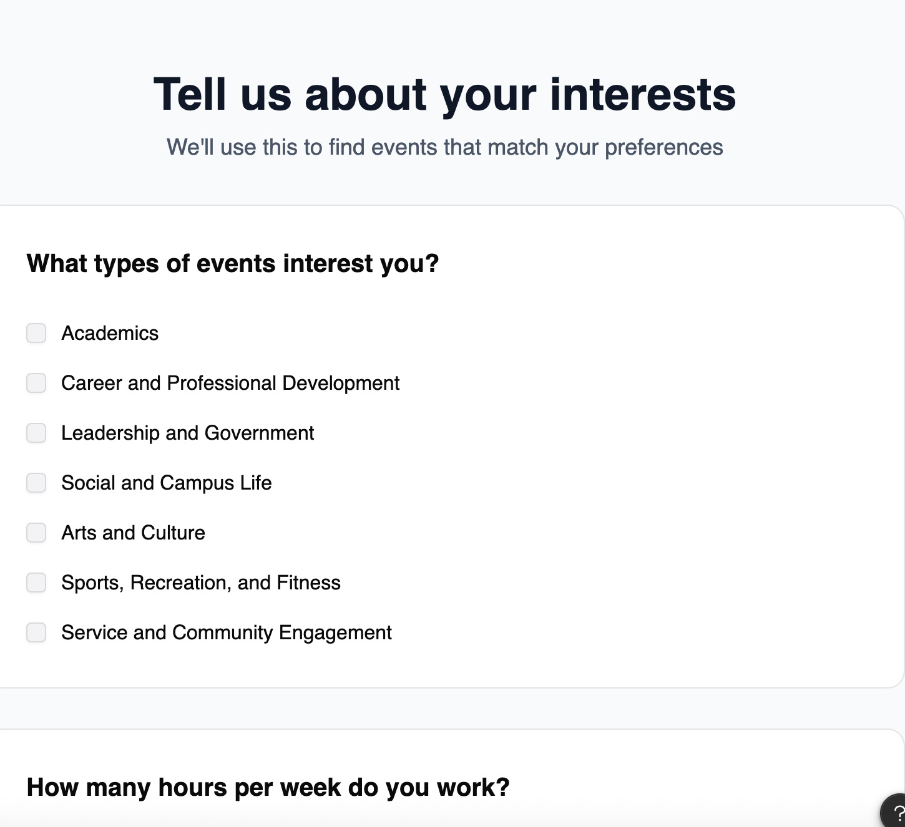
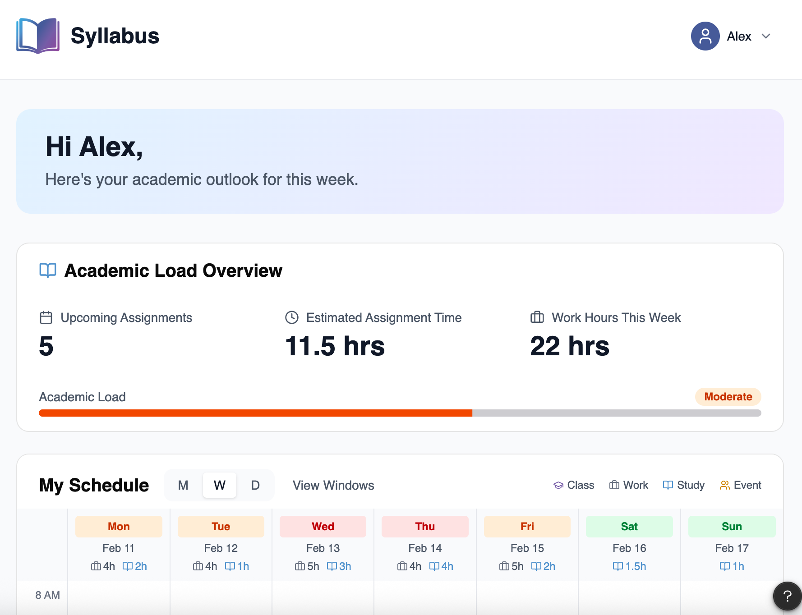
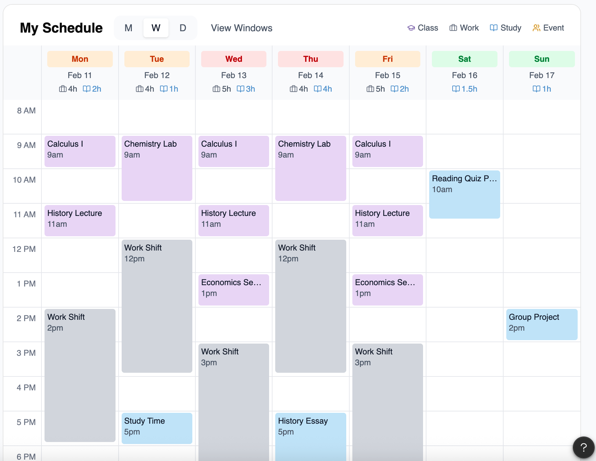
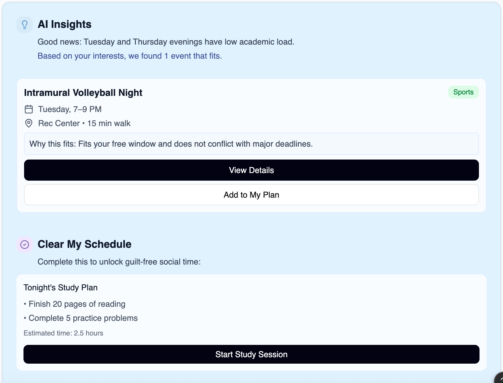
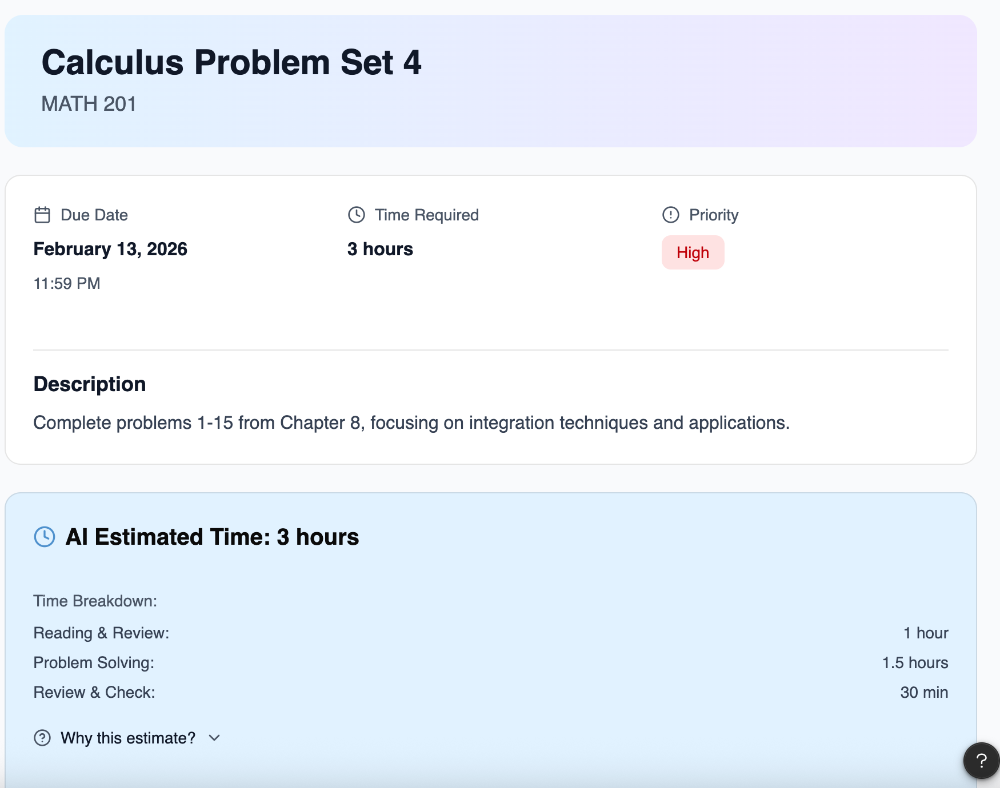
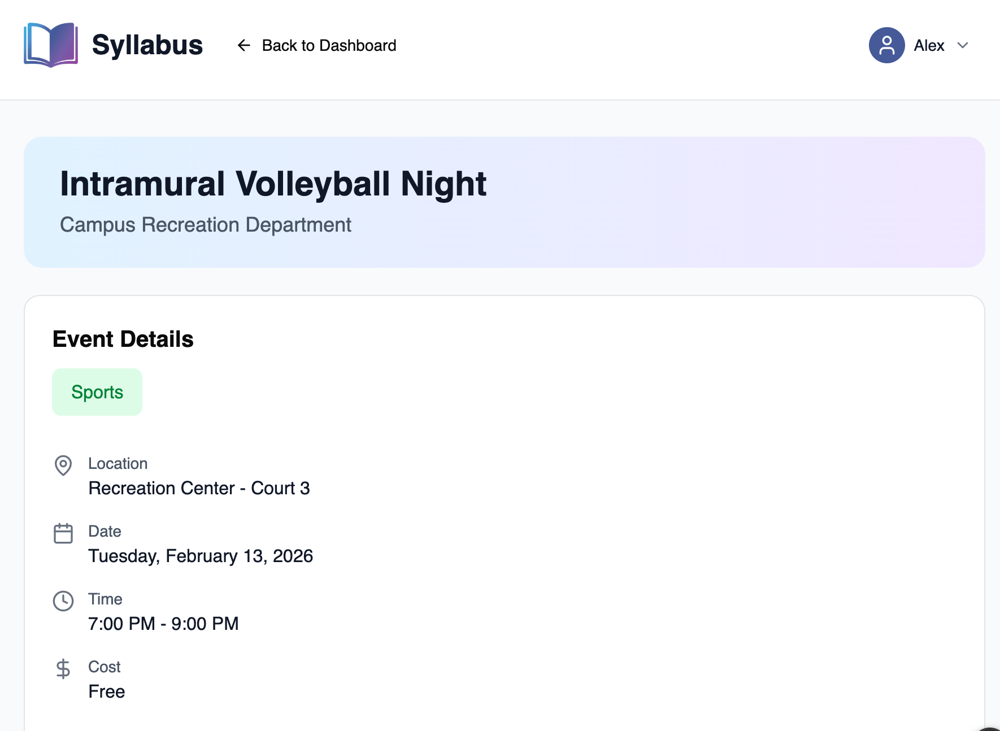
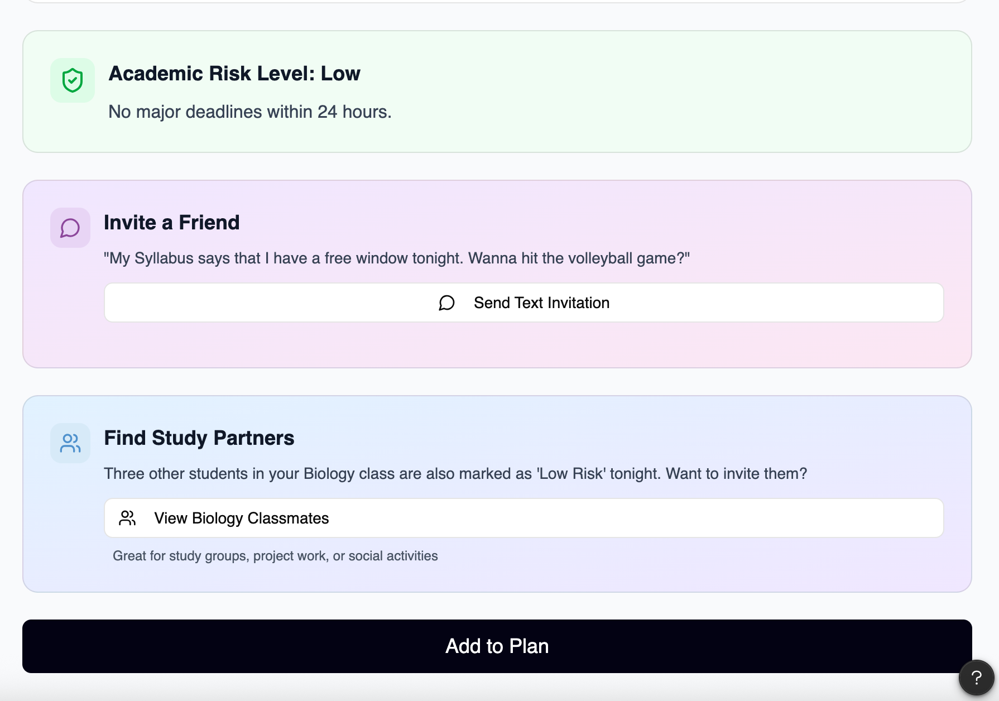

# Syllabus — AI-Powered Student Life Balance App

**[View the Interactive Figma Prototype →](https://www.figma.com/make/4YufmiNgxz7YkJ6ARQx3H8/Student-Life-Balance-App)**

A product design concept built at a hackathon. Syllabus is a mobile app that helps college students manage the impossible balancing act between academics, work, and campus life — using AI to estimate how long their assignments will actually take, and intelligently surfacing campus events that fit around their real schedule.

---

## The Problem

College students are overwhelmed — not because they don't care, but because they have no good way to answer the two hardest questions in student life:

1. **"How long is this assignment actually going to take me?"** — Syllabi give due dates, not time estimates. Students chronically underestimate, pull all-nighters, and miss things.
2. **"When can I actually go out?"** — There are always interesting events on campus, but students either don't know about them or assume they don't have time, even when they do.

The result: students skip activities that would improve their wellbeing, burn out academically, and miss the social fabric of campus life.

---

## The Solution

**Syllabus** sits at the intersection of a smart calendar and a campus life concierge.

It ingests a student's class schedule, work shifts, and assignments, uses AI to estimate completion time for each assignment (and gets better at this over time as it learns your pace), then identifies real free windows in your week. In those windows, it recommends campus events filtered to your interests — showing you not just *what's* happening, but *why right now is a good time to go*.

---

## Key Features

### AI Assignment Time Estimator
The core differentiator. When an assignment is added, the AI breaks it into component tasks (reading, problem-solving, review) and estimates time for each. It learns your personal pace over time — if you consistently take longer on math than the estimate, future estimates adjust. Each estimate includes a "Why this estimate?" breakdown so students understand and trust the reasoning.

### Academic Load Dashboard
At a glance: how many assignments are due this week, total estimated hours required, work hours committed, and an overall "Academic Load" rating (Low / Moderate / High) based on the combination of all three. Color-coded daily view shows class, work, study, and event blocks together so students see the full picture of their week.

### AI Insights & Event Matching
After analyzing the week, the AI surfaces specific free windows ("Tuesday and Thursday evenings have low academic load") and matches them to campus events based on the student's interest profile. Each recommendation shows the event, location, time, cost, and a plain-English explanation of why it fits — not just "here's an event," but "here's an event that fits between your last class and before your deadline."

### "Clear My Schedule" Study Planner
Before going out, the AI generates a focused study plan to complete first — breaking tonight's work into specific tasks with time estimates. Students can leave guilt-free knowing their responsibilities are handled.

### Social Layer
When a student decides to attend an event, they can instantly send a pre-drafted text invitation to friends ("My Syllabus says I have a free window tonight — wanna hit the volleyball game?"). The app also surfaces classmates who are also "low risk" tonight and might want to study or go together.

### Onboarding
Two-step setup: select your university (pulls your class schedule automatically) and select interest categories (Academics, Career & Professional Development, Leadership, Social & Campus Life, Arts & Culture, Sports & Recreation, Service & Community Engagement).

---

## Screen Walkthrough

| Screen | Description |
|---|---|
|  | **Welcome** — App intro with value prop |
|  | **Onboarding: University** — Import class schedule |
|  | **Onboarding: Interests** — Event preference setup |
|  | **Dashboard** — Academic load overview + weekly schedule |
|  | **Schedule** — Color-coded weekly calendar (class / work / study / event) |
|  | **AI Insights** — Free window detection + event recommendation |
|  | **Assignment Detail** — AI time estimate with task breakdown |
|  | **Event Detail** — Full event info with context |
|  | **Social Layer** — Academic risk check, friend invite, study partner finder |

---

## Design Decisions & PM Thinking

**Why AI time estimation instead of letting students enter their own?**
Students are notoriously bad at estimating how long work will take (the planning fallacy). Self-reported estimates would be as unreliable as guessing. An AI that improves with feedback creates actual accuracy over time and removes the cognitive burden from the student entirely.

**Why show "Why this fits" on every event recommendation?**
Students are skeptical of black-box recommendations. Showing the reasoning ("this fits your free window and doesn't conflict with major deadlines") builds trust and helps students feel confident saying yes instead of anxiously second-guessing whether they're missing something.

**Why the "Clear My Schedule" gate before going out?**
This is the key behavioral insight: students don't skip events because they can't afford the time — they skip because they feel guilty leaving unfinished work unplanned. By creating a concrete, completable study block first, the app gives students permission to go enjoy themselves. Guilt-free social time is the unlock.

**Why social features on the event detail page?**
The most common reason students skip campus events is "I don't want to go alone." By surfacing friends and classmates who also have free time, Syllabus lowers the activation energy for going. The pre-drafted friend text removes even the friction of figuring out what to say.

---

## Product Vision

Syllabus addresses a real gap: universities generate enormous amounts of scheduling data (classes, assignments, events, room bookings) but none of it is synthesized for the student. A student's Canvas, Google Calendar, campus events board, and friends' schedules are completely siloed. Syllabus is the layer that connects them.

The long-term roadmap would explore:
- **University partnerships** for verified data feeds (class schedules, events, dining, rec centers)
- **Adaptive learning** that improves time estimates across similar courses and assignment types
- **Group planning** — coordinating schedules with friend groups to find shared free windows
- **Wellness integration** — surfacing mental health resources and break reminders during high-load weeks
- **Faculty tools** — giving professors aggregate, anonymized insight into when their class's workload peaks relative to other courses

---

## Project Context

Built at a hackathon as a team concept project. My role focused on defining the core user problem, designing the AI time estimation flow, and structuring the product logic behind the event recommendation engine and "Clear My Schedule" feature.

**Tools used:** Figma (UI design + prototyping), Figma Make (interactive prototype)
